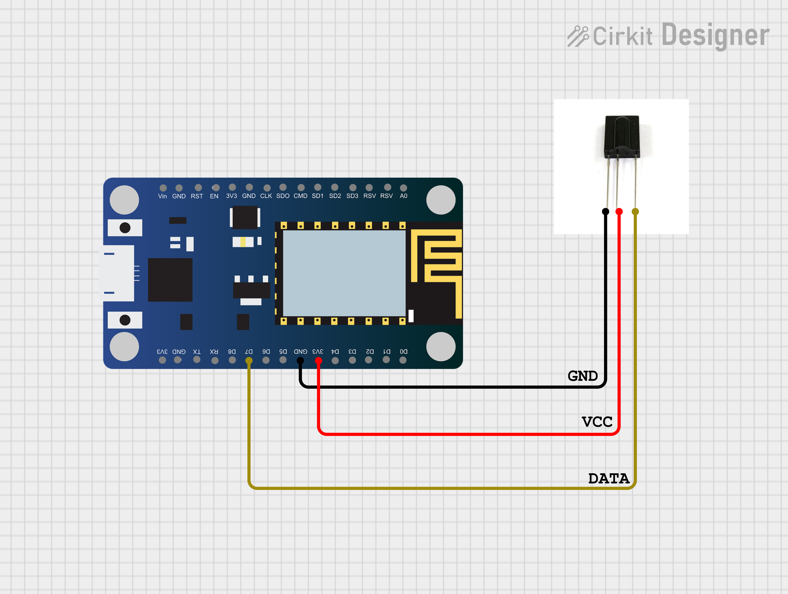
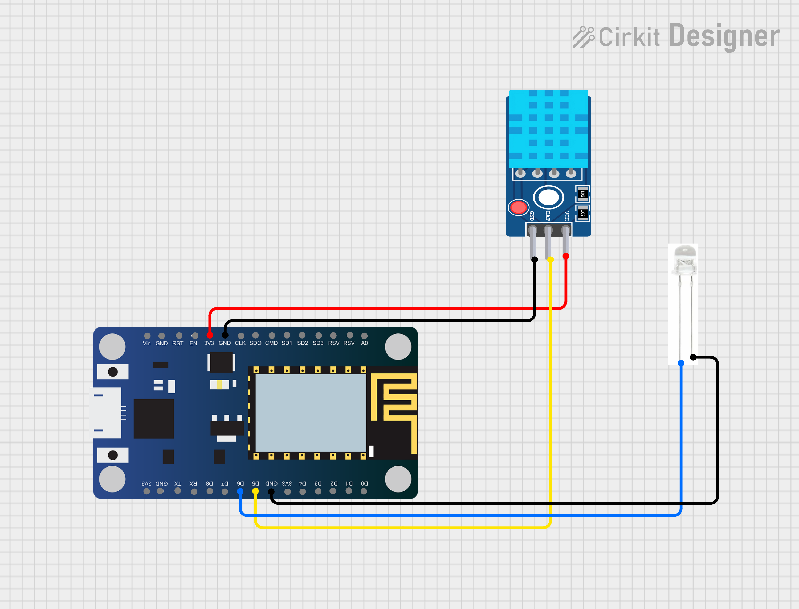

# Auther
* Name: Gautam Makadia
* Phone : +91 8511083075
* Email: gautammakadia3002@gmail.com
# Library required
* IR Remote ESP8266 library (https://github.com/crankyoldgit/IRremoteESP8266)
* DHT Sensor (https://github.com/adafruit/DHT-sensor-library)

# Dump Remote Data
1. Connect `TSOP 1738` sensor data pin to `D7 (GPIO 13)`, other connection to `VCC` and `GND` acordingly.
2. Connect to the serial monitor.
3. Point remote to the sensor and press the .
    * Power On then Power Off to recive the the data.
    * Then recive all temprature levels.
4. It will print the data each time on serial monitor.
5. copy each output one by one and order in text file (On -> OFF -> 30 -> 29 -> So on...).

# Project Setup
1. DHT11: data pin to `D5 (GPIO 14)`


2. IR LED: (+) `D6 (GPIO 12)`, (-) `GND`

3. Copy the apropriate ir code for temprature level from dumped data text file and past it in the code 
 ```cpp
 uint16_t Temp24[583] = {/*paste code for temp 24 here*/}
 ```


# Circuite Diagrams

## 1. IrReciveDump


## 2. Working Module
- `Yello` - Data pin of dht11 to `D5`
- `Blue` -  (`+`) anode of ir led to `D6`

